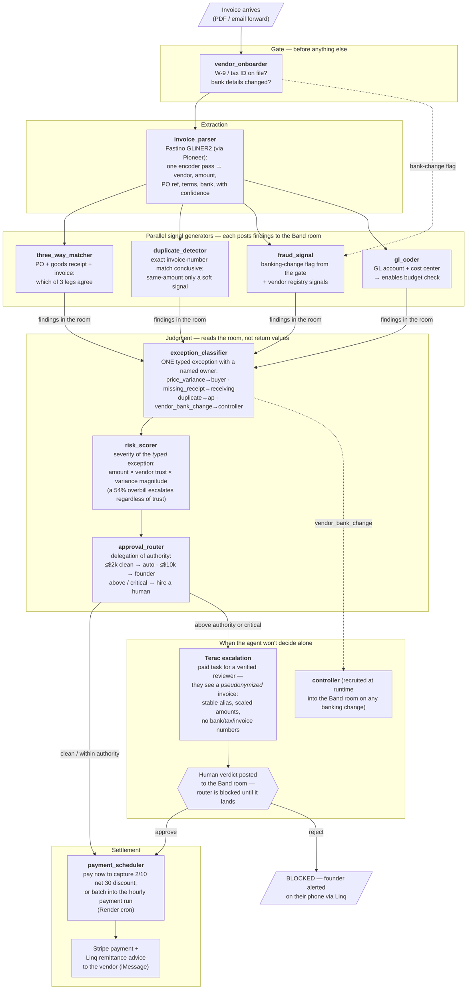

# PO1 — Purchase Order One

**The finance hire a startup never makes.**

An autonomous accounts-payable department: ten agents that verify vendors, match invoices against purchase orders *and* goods receipts, classify exceptions the way a real AP policy does, pay what they can defend — and buy verified human judgment, mid-pipeline, the moment they can't.

Built solo in one day at the **Zero-Human Company Hackathon by Terac** (San Francisco, Aug 15, 2026).

**Live:** https://po1-api.onrender.com

## Why accounts payable

Startups make their first finance hire around employee 8 — not when the work starts, but when they can finally afford $1,400–$2,800/mo for a fractional CFO. Until then a founder eyeballs invoices at midnight, and the most expensive failure modes in AP go unwatched:

- **Vendor banking changes** — the #1 real-world AP fraud. Not fake invoices: a convincing email asking to update a *real* vendor's bank account.
- **Overbilling against the PO** — billed 54% over what was agreed, paid anyway because nobody compared.
- **Paying for goods never received** — the reason real AP runs a *3-way* match (PO + goods receipt + invoice), not a 2-way.
- **Missed early-payment discounts** — `2/10 net 30` is ~37% annualized return on paying 20 days early. A tired founder never captures it.

PO1 charges $299/mo (5–10× under the cheapest human alternative) plus a metered fee per human judgment actually consumed. The agent mints its own Stripe checkout per sale.

## The thesis

> Autonomy isn't doing everything alone — it's knowing the exact moment to buy human judgment.

PO1 **never** self-approves a vendor banking change. It classifies the exception, recruits a controller into the agent room at runtime, opens a paid task on Terac's expert network, and **blocks** until a verified human rules. The human's verdict is a message in the room — remove the room and the pipeline genuinely stops.

## Agent orchestration

Ten specialists plus a runtime-recruited controller. Every handoff is a real message in a shared **Band** room — each agent holds its own registered Band identity and signs its own findings. Downstream agents read their inputs *from the room*, not from function returns.



### Why a typed exception, not a risk score

Most automated-AP designs blend every signal into one number. Real AP departments classify the *type* of problem first, because the type determines **who fixes it**: a price variance goes back to the buyer, a missing receipt to receiving, a duplicate to AP, a banking change to the controller — never self-approved. `exception_classifier` is the structural heart of the system; `risk_scorer` only decides *how loudly* to escalate.

### The human-input loop (Terac)

1. Flagged invoices open a **paid task** on Terac's network — a real, verified human rules approve / reject / investigate on a page PO1 hosts.
2. A **general-population labeling study** (launched live during the hackathon — 7 submissions, 4 approved, within 15 minutes) collects risky/safe labels on pseudonymized invoices → training data for a Pioneer fine-tune of `fraud_signal`, evaluated before/after on a fixed batch.
3. **Terac webhooks** carry approvals back: the room hears it, the founder's phone hears it, the escalation row closes.

### Privacy by construction

Outside reviewers never see real commercial data. Vendors map to **stable pseudonyms** (the same vendor is always the same alias, so "we've paid them 20 times" stays true), amounts scale by a fixed factor (**ratios survive** — a 54% overbill still reads as 54%), and bank accounts / tax IDs / invoice numbers are withheld entirely. The mapping lives in-process, so the verdict still applies to the real invoice while the reviewer holds nothing real.

## Sponsor integrations — all load-bearing

| Sponsor | Role | Why it can't be removed |
|---|---|---|
| **Terac** | Human judgment supply | Escalations block on a verified reviewer's verdict; labeling study feeds the fine-tune; webhook closes the loop |
| **Band** | The agent floor | All 11 agents post under own identities; classifier reads findings *from the room*; controller recruited at runtime; verdicts unblock the router |
| **Pioneer** | The model layer | Every agent thinks on open-weight Qwen (3-4B mechanical / 8B judgment); parser is **Fastino GLiNER2**, one encoder pass |
| **Linq** | Real-world comms | Remittance advice (the actual AP document), variance queries (tapback = answer), founder alerts — real iMessages |
| **Render** | Unattended operation | Web service + hourly cron payment run + persistent disk for human labels |
| **Stripe** | Revenue | Agent mints a checkout per transaction; restricted read-only key feeds live revenue to the ledger |

## Run it

```bash
cd backend
python -m venv .venv && .venv/Scripts/activate   # or source .venv/bin/activate
pip install -r requirements.txt
cp .env.example .env                              # add your keys
python -m database.seed_ap
uvicorn main:app --reload --port 8000
```

Open http://localhost:8000 — the Ledger Floor — and hit **Run the day's intake**.

Key endpoints: `POST /po1/process` (upload an invoice) · `POST /po1/demo` (run the sample day) · `GET /po1/invoices` · `/review/{id}` (what a Terac reviewer sees) · `/label` (the labeling task) · `POST /po1/terac/webhook` · `POST /po1/linq/inbound`

## Team

**Kenil Himmatbhai Vaghasiya** — everything.

Built during the hackathon: the ten-agent AP architecture (3-way matching, typed exceptions, delegation of authority, payment scheduling), all six sponsor integrations, the privacy layer, the fine-tune loop, the Ledger Floor UI, and the deployment.
